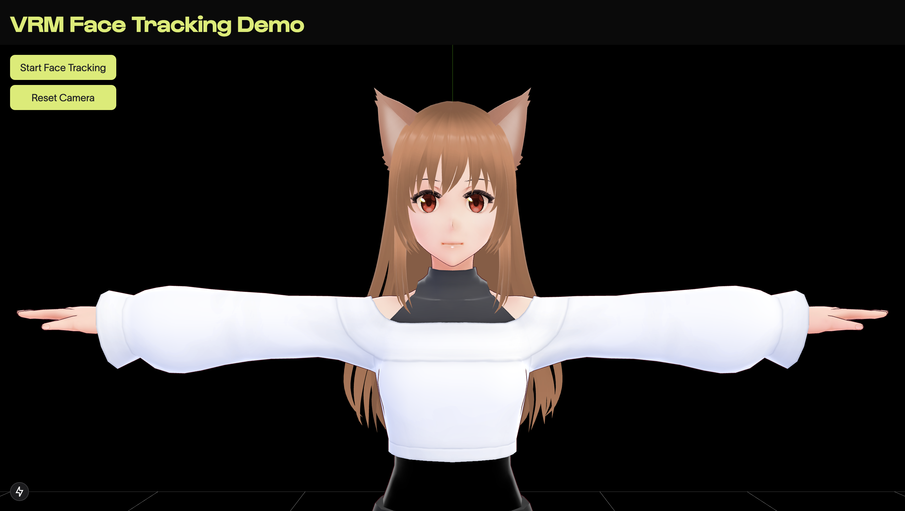

# Hololabs Take Home - VRM Face Tracking Demo



This is a [Next.js](https://nextjs.org) project bootstrapped with [`create-next-app`](https://nextjs.org/docs/app/api-reference/cli/create-next-app).

The goal was to have a project that could track a user's facial movement and translate it into a VRM model using [Three.js](https://threejs.org/). and [MediaPipe Face Landmarker](https://mediapipe-studio.webapps.google.com/demo/face_landmarker).

## Getting Started

First, run the development server:

```bash
npm run dev
# or
yarn dev
# or
pnpm dev
# or
bun dev
```

Open [http://localhost:3000](http://localhost:3000) with your browser to see the application running.

## Extra notes

Start time: 09:10AM

- created app with `npx create-next-app@latest hololabs-take-home --typescript`
- added dependencies for three and pixiv/three-vrm
- updated Tailwind for using colors and fonts
- added VRM model to scene
- added Google MediaPipe dependency
- added video preview and buttons for tracking
- spent quite some time trying to figure out the angles that needed to be put for the neck rotation to work properly
- added a reset camera button
- updated README and cleaned up some files, adding some useful #region comments

There is a reported error with "CPU", I couldn't figure out what's causing it. It could be an issue with Firefox or something else. Doesn't seem to happen on a HTTPS site (deployed on Vercel).

End time: 02:00PM
